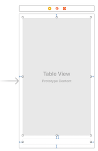
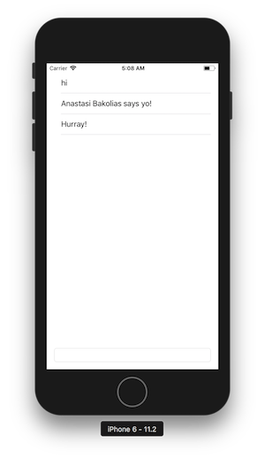

# Creating your own UI with the Smooch iOS SDK

**This guide shows you how to create your own UI for the Smooch iOS SDK.**

The Smooch iOS SDK comes with a rich prebuilt user interface with the option to configure the interface using the Smooch dashboard or the REST API.

If needed you can completely replace Smooch's default UI with your own interface.

Although you can replace the default UI, note that this means rewriting support for all the Smooch message types, that you want to support in your custom UI.

## Overview

The iOS SDK can be initialized without displaying it's default UI. You can then make use of the SDK's messaging APIs to send messages, and it's conversation delegate methods to receive messages.

This guide is separated into two parts:
- [Part One](#) for setting up a generic messaging UI in iOS
- [Part Two](#) for integrating Smooch methods in to add the messaging functionality.

It will help to have the [SDK documentation](https://docs.smooch.io/api/ios/index.html) on hand while following this guide.

The complete code for this guide is included in this repository.

## Part One: setting up the UI

In part one we'll set up the UI that we'll be integration Smooch with in part two.

### 1. Create a new project
Create a new single view app project  and select Swift as the language.

### 2. Add UI elements
In the _Main.storyboard_ file add a Text Field and a Table View. The Text Field will be our message input. The Table View will contain the conversation history.


### 3. Connect UI elements to the view controller
Using the assistant editor, ctrl drag both UI elements from _Main.storyboard_ into _ViewController.swift_ to connect them to referencing outlets.

Name the Text View _messageInput_  and the Table View _conversationHistory_.

Your _ViewController.swift_ file should now look like this:

```swift
class ViewController: UIViewController {
    @IBOutlet weak var messageInput: UITextField!
    @IBOutlet weak var conversationHistory: UITableView!

    override func viewDidLoad() {...}
}
```

### 4. Handle input from the Text View
Now we're going to handle the user hitting the enter key while typing so that we can treat their input as a message.

First we'll create a function called _endOfInput_ in the _ViewController_ class in _ViewController.swift_ to handle the event:

```swift
@objc func endOfInput(){
    messageInput.resignFirstResponder()
    let text = messageInput.text!.trimmingCharacters(in: .whitespacesAndNewlines)
    if text.count > 0 {
        print("Message: \(text)")
    }
    messageInput.text = ""
}
```

The _endOfInput_ function is logging the text to the console and resetting the Text View to an empty state. When we implement the Smooch pieces, this is where we'll place our code to call smooch instead of logging text.

In our _viewDidLoad_ method, we'll add this line to attach our _endOfInput_ function to the UI element:
```swift
messageInput.addTarget(self, action: #selector(endOfInput), for: .editingDidEndOnExit)
```

### 5. Attach a data source to the Table View
We're now going to connect a data source to the Table View to represent message history in the conversation.

We'll start by extending our _viewController_, with _UITableViewDataSource_ to double as a data source. In _ViewController.swift_, add _UITableViewDataSource_ to the _ViewController_ class like so:

```swift
class ViewController: UIViewController, UITableViewDataSource {...}
```

Now we'll add methods to compute the number of rows in the table and fill them with content. Add _numberOfRowsInSection_ and _cellForRowAt_ methods to _ViewController_, also add an _items_ list to _ViewController_ to act as a store of messages. The new properties and methods should look like this:

```swift
class ViewController: UIViewController, UITableViewDataSource {
  var items: [Any] = []

  func tableView(_ tableView: UITableView, numberOfRowsInSection section: Int) -> Int {
    return items.count
  }

  func tableView(_ tableView: UITableView, cellForRowAt indexPath: IndexPath) -> UITableViewCell {
      let cell = tableView.dequeueReusableCell(withIdentifier: "MessageCell", for: indexPath)
      cell.textLabel!.text = "Item"
      return cell
  }
  ...
}
```

We'll modify the _cellForRowAt_ code to transform Smooch messages into table cells in the next part of this guide.

Finally, we'll connect the Table View to the data source and render it in the _viewDidLoad_ delegate method in _ViewController.swift_. Add these three lines of code to _viewDidLoad_

```swift
override func viewDidLoad() {
    ...
    conversationHistory.tableFooterView = UIView()
    conversationHistory.dataSource = self
    conversationHistory.register(UITableViewCell.self, forCellReuseIdentifier: "MessageCell")
}
```

---

That concludes the first part of this guide. At this point your _ViewController.swift_ file should look like this:

```swift
import UIKit

class ViewController: UIViewController, UITableViewDataSource {
    @IBOutlet weak var conversationHistory: UITableView!
    @IBOutlet weak var messageInput: UITextField!

    @objc func endOfInput(){
        messageInput.resignFirstResponder()
        let text = messageInput.text!.trimmingCharacters(in: .whitespacesAndNewlines)
        if text.count > 0 {
            print("Message: \(text)")
        }
        messageInput.text = ""
    }

    override func viewDidLoad() {
        super.viewDidLoad()
        messageInput.addTarget(self, action: #selector(endOfInput), for: .editingDidEndOnExit)
        conversationHistory.tableFooterView = UIView()
        conversationHistory.dataSource = self
        conversationHistory.register(UITableViewCell.self, forCellReuseIdentifier: "MessageCell")
    }

    var items: [Any] = []

    func tableView(_ tableView: UITableView, numberOfRowsInSection section: Int) -> Int {
        return items.count
    }

    func tableView(_ tableView: UITableView, cellForRowAt indexPath: IndexPath) -> UITableViewCell {
        let cell = tableView.dequeueReusableCell(withIdentifier: "MessageCell", for: indexPath)
        cell.textLabel!.text = "Item"
        return cell
    }
}
```

And your _Main.storyboard_ should look like this:



---

## Part Two: adding messaging to the app
Now that we've defined the UI for our messaging application, we can call Smooch's core messaging methods to add functionality.

### 1. Integrate Smooch

See this [guide](https://docs.smooch.io/guide/native-ios-sdk/) for adding the Smooch framework to your app. We've included a quick start here. We'll assume you have [Cocoapods](https://cocoapods.org/). In the terminal:
- run `pod init`
- add `pod 'Smooch'` to the _Podfile_
- run `pod install`
- follow the instructions in the terminal for re-opening the project in Xcode.

Now in _AppDelegate.swift_ AND _ViewController.swift_, import Smooch:

```swift
import Smooch
```

And, in _didFinishLaunchingWithOptions_ in _AppDelegate.swift_, add a line to initialize Smooch replacing `"<your_app_id>"` with your Smooch app ID:

```swift
func application(_ application: UIApplication, didFinishLaunchingWithOptions launchOptions: [UIApplicationLaunchOptionsKey: Any]?) -> Bool {
    Smooch.initWith(SKTSettings(appId: "<your_app_id>"))
    return true
}
```

### 2. Send messages

When the user enters text input and hits _enter_ we're going to send an app user message to Smooch.

In our _endOfInput_ function in _ViewController.swift_ replace the _print_ statement with the following line:

```swift
Smooch.conversation()?.sendMessage(SKTMessage(text: text))
```

The _endOfInput_ function should now look like this:

```swift
@objc func endOfInput(){
    messageInput.resignFirstResponder()
    let text = messageInput.text!.trimmingCharacters(in: .whitespacesAndNewlines)
    if text.count > 0 {
        Smooch.conversation()?.sendMessage(SKTMessage(text: text))
    }
    messageInput.text = ""
}
```

### 3. Display messages
Now we're going to pass our initial conversation state to the Table View's data source.

Add a line to assign _items_ to the value of Smooch's conversation history to the _viewDidLoad_ delegate method:

```swift
override func viewDidLoad() {
    ...
    if let messages = Smooch.conversation()?.messages {
        self.items = messages
    }
}
```

Next, in our _cellForRowAt_ method, we want to set the value of the cell to the message and name of the sender.

Replace the code that sets the value of the cell to `"Item"` with this:

```swift
let message = items[indexPath.row] as! SKTMessage
let text = message.role == "appMaker" ? "\(message.name!) says \(message.text!)" : message.text!
cell.textLabel!.text = text
```

The _cellForRowAt_ method should now look like this:

```swift
func tableView(_ tableView: UITableView, cellForRowAt indexPath: IndexPath) -> UITableViewCell {
    let cell = tableView.dequeueReusableCell(withIdentifier: "MessageCell", for: indexPath)
    let message = items[indexPath.row] as! SKTMessage
    let text = message.role == "appMaker" ? "\(message.name!) says \(message.text!)" : message.text!
    cell.textLabel!.text = text
    return cell
}
```

### 4. Update the UI with new messages
Smooch exposes [conversation delegate methods](https://docs.smooch.io/api/ios/Protocols/SKTConversationDelegate.html) that allow you to capture incoming and outgoing messages as well as other events. We're going to use these methods to display new messages in our UI.

First we're going to extend our _ViewController_ class with _SKTConversationDelegate_ like so:

```swift
class ViewController: UIViewController, UITableViewDataSource, SKTConversationDelegate {...}
```

In the _viewDidLoad_ delegate method, we need to attach our _ViewController_ as delegate to the Smooch conversation by adding this line:

```swift
override open func viewDidLoad() {
    ...
    Smooch.conversation()?.delegate = self
}
```

Now, we can add conversation delegate methods to our class. We'll start with [willSendMessage](https://docs.smooch.io/api/ios/Protocols/SKTConversationDelegate.html#//api/name/conversation:willSendMessage:) to capture newly sent messages in the UI. Add the following method to your _ViewController_ class:

```swift
class ViewController: UIViewController, UITableViewDataSource, SKTConversationDelegate {
    ...
    func conversation(_ conversation: SKTConversation, willSend message: SKTMessage) -> SKTMessage {
        self.items.append(message)
        conversationHistory.reloadData()
        return message
    }
}
```

Lastly, in order to receive new messages from the business, we can implement the [didReceiveMessages](https://docs.smooch.io/api/ios/Protocols/SKTConversationDelegate.html#//api/name/conversation:didReceiveMessages:) conversation delegate method. Add the following method to your _ViewController_ class:

```swift
class ViewController: UIViewController, UITableViewDataSource, SKTConversationDelegate {
    ...
    func conversation(_ conversation: SKTConversation, didReceiveMessages messages: [Any]) {
        if let allMessages = Smooch.conversation()?.messages {
            self.items = allMessages
        }

        conversationHistory.reloadData()
    }
}
```

## Wrap up

You've created your own UI for the Smooch iOS SDK. It should look like this:



Now you might want to consider how you'll represent more complex messages and activities, such as:
- [structured messages](https://docs.smooch.io/guide/structured-messages/)
- [conversation extensions](https://docs.smooch.io/guide/conversation-extensions/)
- [conversation activity](https://docs.smooch.io/rest/#conversation-activity)

You can also follow [these instructions](https://docs.smooch.io/guide/native-ios-sdk/#step-5-repeat-for-production-mode) for handling push notifications.

---

## Running the code in this repository

The complete code for this guide is included in this repository. To run the code:
- clone the repo
- run `pod install`
- open _custom-ui-ios.xcworkspace_ in Xcode
- replace _<your_app_id>_ in _AppDelegate.swift_ with your Smooch app ID
- and build and run the project in the device emulator.
